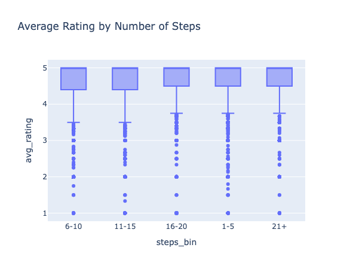
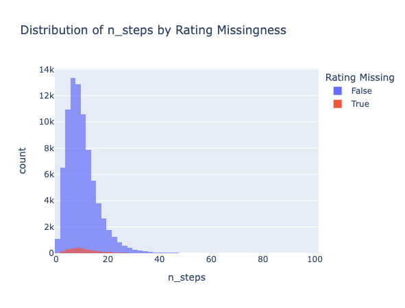

# Recipe Complexity and Ratings Analysis

**By: Wanhan**

## Introduction

Have you ever wondered whether spending hours on an elaborate recipe is actually worth it? This project investigates the relationship between recipe complexity and user ratings using data from Food.com.

The dataset contains recipes and user interactions from Food.com. We merged the recipes dataset with user ratings to analyze whether more complex recipes — those with more steps, more ingredients, or longer cooking times — tend to receive higher or lower ratings. This question matters for home cooks deciding how much effort to invest, recipe developers designing new content, and anyone curious about what makes a recipe successful.

**Number of rows:** 83,782

### Relevant Columns

| Column | Description |
|--------|-------------|
| `name` | Recipe name |
| `id` | Unique recipe identifier |
| `minutes` | Minutes to prepare recipe |
| `n_steps` | Number of steps in recipe |
| `n_ingredients` | Number of ingredients in recipe |
| `avg_rating` | Average user rating (1-5 scale), computed from merged ratings data |
| `calories` | Calories per serving (extracted from nutrition) |

**Central Question:** What is the relationship between recipe complexity and average rating?

## Data Cleaning

We performed the following cleaning steps:

1. **Left merged** the recipes and interactions datasets on recipe ID.
2. **Replaced ratings of 0 with `NaN`** because the rating scale is 1-5; a rating of 0 indicates a missing rating (user left a review without selecting stars), not an actual score.
3. **Computed average rating** per recipe and added it back to the recipes dataset.
4. **Extracted nutrition components** from the `nutrition` column (stored as a list) into separate columns: `calories`, `total_fat`, `sugar`, `sodium`, `protein`, `saturated_fat`, and `carbohydrates`.
5. **Converted `submitted`** to datetime format.

Here is the head of the cleaned DataFrame:

| name | id | minutes | n_steps | n_ingredients | avg_rating | calories |
|------|-----|---------|---------|---------------|------------|----------|
| 1 brownies in the world best ever | 333281 | 40 | 10 | 9 | 4.0 | 138.4 |
| 1 in canada chocolate chip cookies | 453467 | 45 | 12 | 11 | 5.0 | 595.1 |
| 412 broccoli casserole | 306168 | 40 | 6 | 9 | 5.0 | 194.8 |
| millionaire pound cake | 286009 | 120 | 7 | 7 | 5.0 | 878.3 |
| 2000 meatloaf | 475785 | 90 | 17 | 13 | 5.0 | 267.0 |

## Univariate Analysis

The distribution of recipe steps is right-skewed, with most recipes containing between 5 and 15 steps. Very few recipes exceed 40 steps.

## Bivariate Analysis

The box plot shows that median ratings remain relatively consistent across complexity groups (around 4.6-4.7), suggesting that the number of steps alone may not strongly influence ratings. However, simpler recipes (1-5 steps) show slightly more variation in ratings.

## Interesting Aggregates

| steps_bin | avg_rating | minutes | n_ingredients | calories |
|-----------|------------|---------|---------------|----------|
| 1-5 | 4.638 | 67.78 | 6.94 | 330.24 |
| 6-10 | 4.616 | 124.80 | 8.78 | 403.54 |
| 11-15 | 4.618 | 117.40 | 10.32 | 466.14 |
| 16-20 | 4.638 | 135.29 | 11.50 | 542.26 |
| 21+ | 4.647 | 187.23 | 12.84 | 662.62 |

This table shows that while average ratings remain stable across complexity groups, more complex recipes tend to have longer cooking times, more ingredients, and higher calories. Interestingly, the most complex recipes (21+ steps) have the highest average rating at 4.647.

## Assessment of Missingness

### NMAR Analysis

We believe the `description` column (70 missing values) is likely **NMAR** (Not Missing At Random). Users may skip writing descriptions for very simple or obvious recipes where they feel no explanation is needed — meaning the missingness depends on the description content itself. Additional data that could help explain this missingness (making it MAR) would be information about the recipe submission interface, such as whether descriptions were required or optional at different time periods.

### Missingness Dependency

We analyzed whether the missingness of `avg_rating` (2,609 missing values) depends on other columns.

**Missingness depends on `n_steps`:**

We performed a permutation test comparing the mean number of steps for recipes with missing ratings versus those with ratings.

- Null Hypothesis: The distribution of `n_steps` is the same for recipes with and without missing ratings.
- Alternative Hypothesis: The distribution of `n_steps` differs between the two groups.
- Test Statistic: Difference in means
- Significance Level: α = 0.05

Result: Observed difference = 1.493, p-value ≈ 0.000. We reject the null hypothesis — the missingness of `avg_rating` **does depend on** `n_steps`. Recipes with missing ratings tend to have more steps.

**Missingness does not depend on `protein`:**

We performed the same permutation test using the `protein` column.

- Null Hypothesis: The distribution of `protein` is the same for recipes with and without missing ratings.
- Alternative Hypothesis: The distribution of `protein` differs between the two groups.
- Test Statistic: Difference in means
- Significance Level: α = 0.05

Result: Observed difference = 1.287, p-value = 0.194. We fail to reject the null hypothesis — the missingness of `avg_rating` **does not depend on** `protein`.
